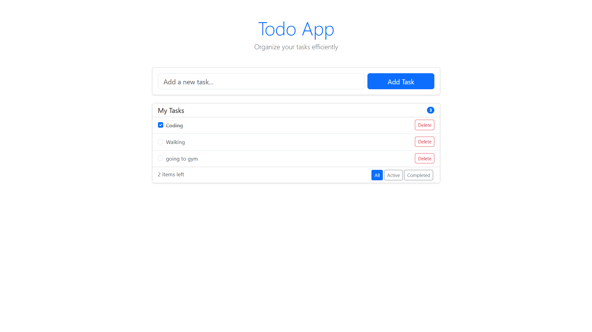

# React ToDo App

A simple ToDo application built with React.

## Features
- Add new tasks
- Mark tasks as complete
- Delete tasks
- Filter tasks

## How to Run
1. Clone this repository
2. Install dependencies: `npm install`
3. Start the app: `npm start`

## Screenshot
 (upload an image of your app)
